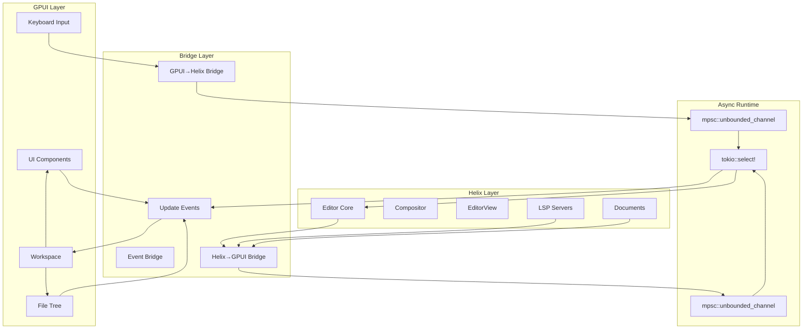
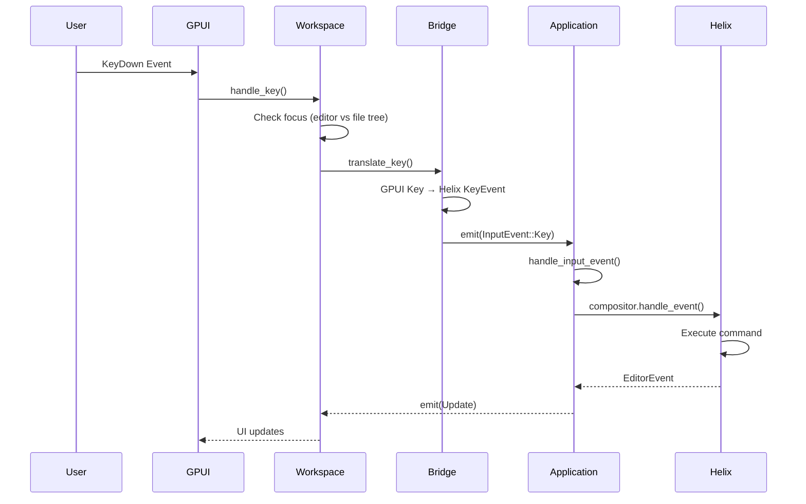
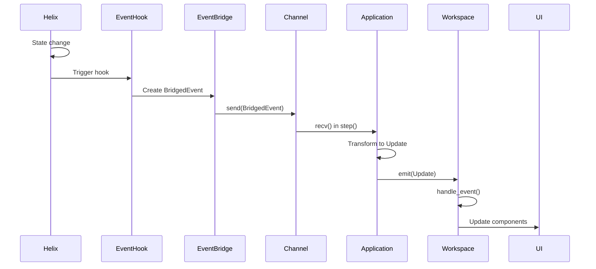

# Event Notification System Documentation

## Overview

The helix-gpui project implements a sophisticated bidirectional event system that bridges GPUI's reactive UI framework with Helix's terminal-based editor core. The system uses multiple async channels, event transformation layers, and specialized bridges to achieve seamless integration between the native GUI and the powerful Helix editor.

## Architecture Overview

The event system consists of three main layers:

1. **GPUI Layer**: Native UI components, user input handling, and visual feedback
2. **Bridge Layer**: Event transformation and channel-based communication
3. **Helix Layer**: Core editor logic, document management, and LSP integration

Communication flows bidirectionally through async channels, with specialized bridges handling event transformation between the two systems.

## Architecture Diagrams

### 1. Overall System Architecture



### 2. GPUI → Helix Event Flow (User Input)



### 3. Helix → GPUI Event Flow (State Updates)



### 4. Component Interaction Diagram

```mermaid
graph LR
    subgraph "Event Types"
        BE[BridgedEvent]
        UE[Update]
        GHE[GpuiToHelixEvent]
        FTE[FileTreeEvent]
    end
    
    subgraph "Core Components"
        APP[Application<br/>- step()<br/>- handle_input_event()]
        WS[Workspace<br/>- handle_event()<br/>- handle_key()]
        EB[EventBridge<br/>- register_hooks()<br/>- forward_event()]
        G2H[GpuiToHelixBridge<br/>- translate_key()<br/>- handle_gpui_event()]
    end
    
    subgraph "UI Components"
        DOC[Document View]
        STAT[StatusLine]
        FT[FileTree]
        PICK[Picker]
        COMP[Completion]
    end
    
    BE --> APP
    GHE --> APP
    APP --> UE
    UE --> WS
    
    WS --> DOC
    WS --> STAT
    WS --> FT
    WS --> PICK
    WS --> COMP
    
    FT --> FTE
    FTE --> WS
```

## Event Types

### 1. BridgedEvent (Helix → GPUI)

Events that originate from Helix's core and need to update the GUI:

```rust
pub enum BridgedEvent {
    DocumentChanged { doc_id: DocumentId },
    SelectionChanged { doc_id: DocumentId, view_id: ViewId },
    ModeChanged { old_mode: Mode, new_mode: Mode },
    DiagnosticsChanged { doc_id: DocumentId },
    DocumentOpened { doc_id: DocumentId },
    DocumentClosed { doc_id: DocumentId },
    ViewFocused { view_id: ViewId },
    LanguageServerInitialized { server_id: LanguageServerId },
    LanguageServerExited { server_id: LanguageServerId },
    CompletionRequested { doc_id: DocumentId, view_id: ViewId, trigger: CompletionTrigger },
}
```

### 2. Update (Central Event Type)

The main event type used throughout the application for UI updates:

```rust
pub enum Update {
    // UI Control Events
    Redraw,
    Prompt(prompt::Prompt),
    Picker(picker::Picker),
    DirectoryPicker(picker::Picker),
    Completion(gpui::Entity<completion::CompletionView>),
    Info(helix_view::info::Info),
    
    // Editor Events  
    EditorEvent(helix_view::editor::EditorEvent),
    EditorStatus(EditorStatus),
    
    // File Operations
    OpenFile(std::path::PathBuf),
    OpenDirectory(std::path::PathBuf),
    
    // Application Control
    ShouldQuit,
    CommandSubmitted(String),
    
    // Bridged Events (granular UI updates)
    DocumentChanged { doc_id: DocumentId },
    SelectionChanged { doc_id: DocumentId, view_id: ViewId },
    ModeChanged { old_mode: Mode, new_mode: Mode },
    // ... (all BridgedEvent variants)
    
    // File System Events
    FileTreeEvent(crate::file_tree::FileTreeEvent),
}
```

### 3. GpuiToHelixEvent (GPUI → Helix)

Events that originate from the GUI and need to affect Helix's state:

```rust
pub enum GpuiToHelixEvent {
    WindowResized { width: u16, height: u16 },
    WindowFocusChanged { focused: bool },
    ThemeChanged { theme_name: String },
    FontSizeChanged { size: f32 },
    ExternalFileChanged { doc_id: DocumentId, path: PathBuf },
    MemoryPressure { level: MemoryPressureLevel },
    AccessibilityChanged { high_contrast: bool, screen_reader: bool },
    PerformanceDegraded { severe: bool },
}
```

### 4. FileTreeEvent

Specialized events for file system interactions:

```rust
pub enum FileTreeEvent {
    SelectionChanged { path: Option<PathBuf> },
    OpenFile { path: PathBuf },
    DirectoryToggled { path: PathBuf, expanded: bool },
    FileSystemChanged { path: PathBuf, kind: FileSystemEventKind },
}
```

## Key Components

### Application (src/application.rs)

The core component that manages the event loop and bridges GPUI with Helix:

- **`step()` function**: Main event loop using `tokio::select!`
- Handles job callbacks, status messages, and bridged events
- Coordinates between multiple async event streams
- Transforms events between systems

### Workspace (src/workspace.rs)

The central UI coordinator that handles all Update events:

- **`handle_event()`**: Processes all Update variants
- **`handle_key()`**: Manages keyboard input with focus awareness
- **`handle_file_tree_event()`**: Processes file system interactions
- Manages overlays, notifications, and UI state

### Event Bridge (src/event_bridge.rs)

Implements the Helix → GPUI event forwarding:

- Registers hooks for various Helix events
- Uses global static sender for thread-safe event forwarding
- Transforms Helix events into BridgedEvent types
- Handles automatic completion triggers

### GPUI to Helix Bridge (src/gpui_to_helix_bridge.rs)

Handles GPUI → Helix communication:

- Key translation from GPUI to Helix format
- Window and system event handling
- Theme and accessibility updates
- Performance monitoring

## Communication Mechanisms

### 1. Async Channels

The system uses Tokio's unbounded MPSC channels for event forwarding:

```rust
// Global event sender for Helix → GPUI
static EVENT_SENDER: OnceLock<mpsc::UnboundedSender<BridgedEvent>> = OnceLock::new();

// Channel creation in event bridge
let (tx, rx) = mpsc::unbounded_channel();
EVENT_SENDER.set(tx).unwrap();
```

### 2. Event Hooks

Helix's event system is extended using hooks:

```rust
helix_event::register_hook!(move |event: &DocumentChangeEvent| {
    forward_event(BridgedEvent::DocumentChanged { 
        doc_id: event.doc_id 
    });
});
```

### 3. GPUI Integration

GPUI's reactive system is used for UI updates:

```rust
// Entity subscriptions
cx.subscribe(&application, |workspace, _, event, cx| {
    workspace.handle_event(event, cx);
});

// Event emission
cx.emit(Update::DocumentChanged { doc_id });
```

### 4. Focus Management

The system maintains focus awareness to route events correctly:

- Editor focus: keyboard events go to Helix
- File tree focus: keyboard events handled by file tree
- Overlay focus: events bypass normal handling

## Event Processing Pipeline

### Input Processing Flow

1. **Key Input**: GPUI captures native keyboard events
2. **Translation**: `translate_key()` converts to Helix format
3. **Focus Check**: Determines target component
4. **Command Execution**: Helix processes the command
5. **State Update**: Changes propagate back to UI

### State Update Flow

1. **State Change**: Helix's internal state changes
2. **Hook Trigger**: Registered hooks fire
3. **Event Creation**: BridgedEvent created
4. **Channel Send**: Event sent through async channel
5. **Update Transform**: Converted to Update event
6. **UI Refresh**: Components re-render with new state

### File Operation Flow

1. **User Action**: Click in file tree
2. **Event Creation**: FileTreeEvent generated
3. **Workspace Handling**: Processes file operation
4. **Editor Command**: Opens file in Helix
5. **Document Creation**: New document created
6. **View Update**: UI shows new document

## Best Practices

### Adding New Events

1. Define the event in the appropriate enum (BridgedEvent, Update, etc.)
2. Register hooks in event_bridge if coming from Helix
3. Add handling in Application::step() or Workspace::handle_event()
4. Update relevant UI components to respond to the event

### Performance Considerations

- Use unbounded channels for low-latency event forwarding
- Batch related updates when possible
- Avoid blocking operations in event handlers
- Use biased select for event priority management

### Debugging Events

1. Add logging at event emission points
2. Monitor channel depths for backpressure
3. Use tracing spans for async event flows
4. Check focus state for input routing issues

## Future Enhancements

1. **Event Filtering**: Add event filtering to reduce unnecessary updates
2. **Event Batching**: Combine rapid sequential updates
3. **Priority System**: Implement event priority for critical updates
4. **Metrics**: Add event system performance monitoring
5. **Testing**: Develop event simulation framework for testing

## Conclusion

The helix-gpui event system successfully bridges two different paradigms - GPUI's reactive UI model and Helix's terminal-based architecture. Through careful use of async channels, event transformation, and focus management, it provides a responsive and intuitive editing experience while maintaining the power and flexibility of Helix's modal editing system.