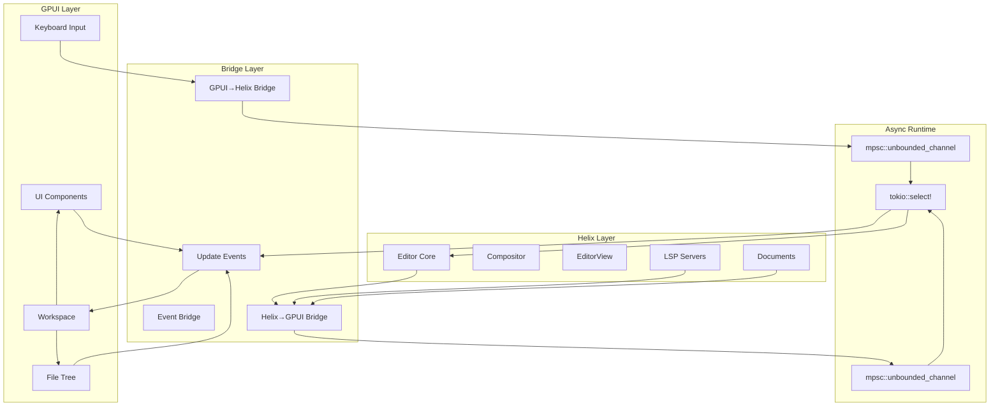
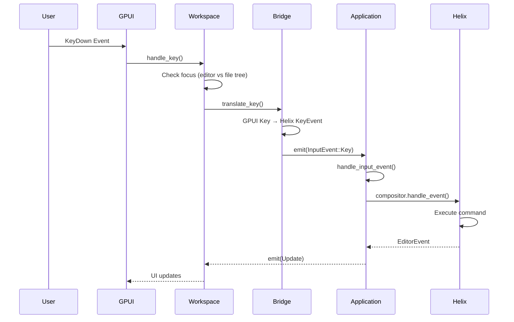
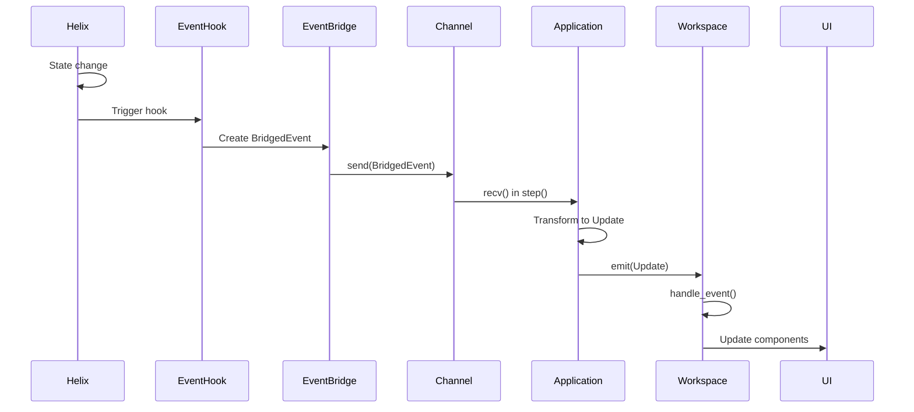
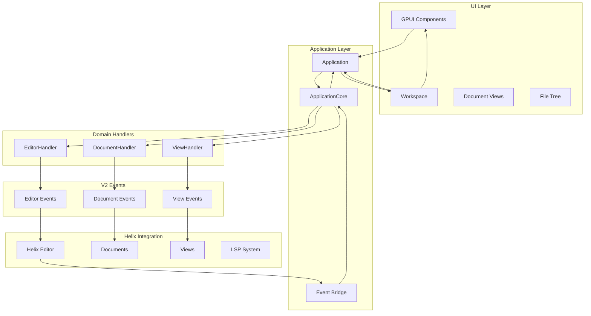
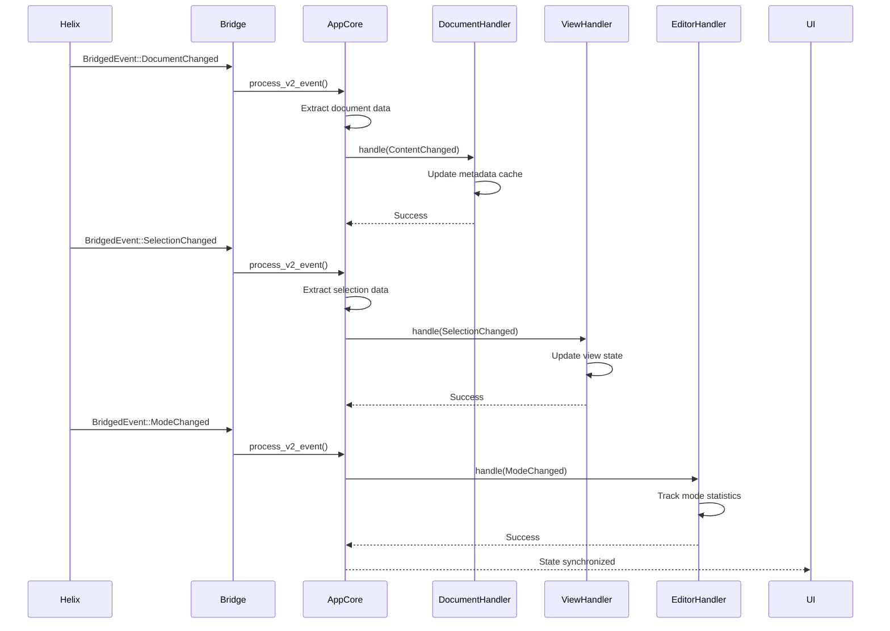

# Event Notification System Documentation

## Overview

The helix-gpui project implements a sophisticated bidirectional event system that bridges GPUI's reactive UI framework with Helix's terminal-based editor core. The system uses multiple async channels, event transformation layers, and specialized bridges to achieve seamless integration between the native GUI and the powerful Helix editor.

## Architecture Overview

The event system has evolved through phases, with the V2 system introducing domain-driven event handling:

### Legacy System (Phase 0)
Three main layers:
1. **GPUI Layer**: Native UI components, user input handling, and visual feedback  
2. **Bridge Layer**: Event transformation and channel-based communication
3. **Helix Layer**: Core editor logic, document management, and LSP integration

### V2 Event System (Phase 1+)
Domain-driven architecture with bounded contexts:
1. **UI Layer**: GPUI components and user interactions
2. **Application Core**: Centralized event coordination and processing
3. **Domain Handlers**: Specialized handlers for document, view, and editor events
4. **Helix Integration**: Direct integration with Helix editor state

Communication flows through both legacy channels (for backward compatibility) and the new V2 domain event system.

## Architecture Diagrams

### 1. Overall System Architecture



### 2. GPUI → Helix Event Flow (User Input)



### 3. Helix → GPUI Event Flow (State Updates)



### 4. Component Interaction Diagram

```mermaid
graph LR
    subgraph "Event Types"
        BE[BridgedEvent]
        UE[Update]
        GHE[GpuiToHelixEvent]
        FTE[FileTreeEvent]
    end
    
    subgraph "Core Components"
        APP[Application<br/>- step()<br/>- handle_input_event()]
        WS[Workspace<br/>- handle_event()<br/>- handle_key()]
        EB[EventBridge<br/>- register_hooks()<br/>- forward_event()]
        G2H[GpuiToHelixBridge<br/>- translate_key()<br/>- handle_gpui_event()]
    end
    
    subgraph "UI Components"
        DOC[Document View]
        STAT[StatusLine]
        FT[FileTree]
        PICK[Picker]
        COMP[Completion]
    end
    
    BE --> APP
    GHE --> APP
    APP --> UE
    UE --> WS
    
    WS --> DOC
    WS --> STAT
    WS --> FT
    WS --> PICK
    WS --> COMP
    
    FT --> FTE
    FTE --> WS
```

### 5. V2 Event System Architecture (Phase 1+)



### 6. V2 Domain Event Flow



### 7. V2 Domain Events (Phase 1+)

The V2 system introduces structured domain events with rich context and metadata:

#### Document Domain Events
```rust
pub enum Event {
    ContentChanged {
        doc_id: DocumentId,
        revision: u64,
        change_summary: ChangeType,
    },
    Opened {
        doc_id: DocumentId,
        path: PathBuf,
        language_id: Option<String>,
    },
    Closed {
        doc_id: DocumentId,
        path: PathBuf,
    },
    DiagnosticsUpdated {
        doc_id: DocumentId,
        diagnostic_count: u32,
        error_count: u32,
        warning_count: u32,
    },
    LanguageChanged {
        doc_id: DocumentId,
        old_language: Option<String>,
        new_language: Option<String>,
    },
}
```

#### View Domain Events
```rust
pub enum Event {
    SelectionChanged {
        view_id: ViewId,
        doc_id: DocumentId,
        selection: Selection,
        was_movement: bool,
    },
    Focused {
        view_id: ViewId,
        doc_id: DocumentId,
        previous_view: Option<ViewId>,
    },
    Scrolled {
        view_id: ViewId,
        scroll_position: ScrollPosition,
        direction: ScrollDirection,
    },
}
```

#### Editor Domain Events
```rust
pub enum Event {
    ModeChanged {
        previous_mode: Mode,
        new_mode: Mode,
        context: ModeChangeContext,
    },
    CommandExecuted {
        command_name: String,
        execution_time_ms: u64,
        success: bool,
        context: CommandContext,
    },
}
```

## Event Types

### 1. BridgedEvent (Helix → GPUI)

Events that originate from Helix's core and need to update the GUI:

```rust
pub enum BridgedEvent {
    DocumentChanged { doc_id: DocumentId },
    SelectionChanged { doc_id: DocumentId, view_id: ViewId },
    ModeChanged { old_mode: Mode, new_mode: Mode },
    DiagnosticsChanged { doc_id: DocumentId },
    DocumentOpened { doc_id: DocumentId },
    DocumentClosed { doc_id: DocumentId },
    ViewFocused { view_id: ViewId },
    LanguageServerInitialized { server_id: LanguageServerId },
    LanguageServerExited { server_id: LanguageServerId },
    CompletionRequested { doc_id: DocumentId, view_id: ViewId, trigger: CompletionTrigger },
}
```

### 2. Update (Central Event Type)

The main event type used throughout the application for UI updates:

```rust
pub enum Update {
    // UI Control Events
    Redraw,
    Prompt(prompt::Prompt),
    Picker(picker::Picker),
    DirectoryPicker(picker::Picker),
    Completion(gpui::Entity<completion::CompletionView>),
    Info(helix_view::info::Info),
    
    // Editor Events  
    EditorEvent(helix_view::editor::EditorEvent),
    EditorStatus(EditorStatus),
    
    // File Operations
    OpenFile(std::path::PathBuf),
    OpenDirectory(std::path::PathBuf),
    
    // Application Control
    ShouldQuit,
    CommandSubmitted(String),
    
    // Bridged Events (granular UI updates)
    DocumentChanged { doc_id: DocumentId },
    SelectionChanged { doc_id: DocumentId, view_id: ViewId },
    ModeChanged { old_mode: Mode, new_mode: Mode },
    // ... (all BridgedEvent variants)
    
    // File System Events
    FileTreeEvent(crate::file_tree::FileTreeEvent),
}
```

### 3. GpuiToHelixEvent (GPUI → Helix)

Events that originate from the GUI and need to affect Helix's state:

```rust
pub enum GpuiToHelixEvent {
    WindowResized { width: u16, height: u16 },
    WindowFocusChanged { focused: bool },
    ThemeChanged { theme_name: String },
    FontSizeChanged { size: f32 },
    ExternalFileChanged { doc_id: DocumentId, path: PathBuf },
    MemoryPressure { level: MemoryPressureLevel },
    AccessibilityChanged { high_contrast: bool, screen_reader: bool },
    PerformanceDegraded { severe: bool },
}
```

### 4. FileTreeEvent

Specialized events for file system interactions:

```rust
pub enum FileTreeEvent {
    SelectionChanged { path: Option<PathBuf> },
    OpenFile { path: PathBuf },
    DirectoryToggled { path: PathBuf, expanded: bool },
    FileSystemChanged { path: PathBuf, kind: FileSystemEventKind },
}
```

## Key Components

### Application (src/application.rs)

The core component that manages the event loop and bridges GPUI with Helix:

- **`step()` function**: Main event loop using `tokio::select!`
- Handles job callbacks, status messages, and bridged events
- Coordinates between multiple async event streams
- Transforms events between systems

### Workspace (src/workspace.rs)

The central UI coordinator that handles all Update events:

- **`handle_event()`**: Processes all Update variants
- **`handle_key()`**: Manages keyboard input with focus awareness
- **`handle_file_tree_event()`**: Processes file system interactions
- Manages overlays, notifications, and UI state

### Event Bridge (src/event_bridge.rs)

Implements the Helix → GPUI event forwarding:

- Registers hooks for various Helix events
- Uses global static sender for thread-safe event forwarding
- Transforms Helix events into BridgedEvent types
- Handles automatic completion triggers

### GPUI to Helix Bridge (src/gpui_to_helix_bridge.rs)

Handles GPUI → Helix communication:

- Key translation from GPUI to Helix format
- Window and system event handling
- Theme and accessibility updates
- Performance monitoring

### V2 System Components (Phase 1+)

#### ApplicationCore (src/application/app_core.rs)

Centralized event processing core extracted from the main Application:

- **`process_v2_event()`**: Main V2 event processing pipeline
- **Domain handler management**: Coordinates document, view, and editor handlers
- **State extraction**: Enriches events with real data from Helix editor state
- **Error handling**: Provides centralized error management for V2 events

#### DocumentHandler (src/application_v2/document_handler.rs)

Handles document-related events with rich metadata:

- **Document lifecycle**: Tracks open, close, and content change events
- **Revision tracking**: Maintains document revision history
- **Language detection**: Monitors language changes and updates
- **Diagnostics aggregation**: Collects and processes LSP diagnostic information
- **Metadata caching**: Maintains document metadata for performance

#### ViewHandler (src/application_v2/view_handler.rs)

Manages view-related events and state:

- **Selection tracking**: Monitors cursor and selection changes with movement detection
- **Focus management**: Tracks view focus changes and maintains focus history
- **Scroll coordination**: Handles view scrolling and position updates
- **View metadata**: Caches view state for quick access and performance
- **Split layout support**: Manages multiple view configurations

#### EditorHandler (src/application_v2/editor_handler.rs)

Coordinates global editor state and command execution:

- **Mode transitions**: Tracks editor mode changes with context and timing
- **Command monitoring**: Records command execution with performance metrics
- **Session tracking**: Maintains mode usage statistics and session timing
- **Performance profiling**: Monitors slow commands and execution patterns
- **History management**: Maintains command history with configurable limits

#### ViewManager (src/workspace/view_manager.rs)

Extracted view management logic from Workspace:

- **Document view lifecycle**: Creates and manages DocumentView entities
- **Focus coordination**: Handles view focus changes and restoration
- **View state synchronization**: Keeps UI views in sync with editor state
- **Performance optimization**: Reduces workspace complexity and improves modularity

## Communication Mechanisms

### 1. Async Channels

The system uses Tokio's unbounded MPSC channels for event forwarding:

```rust
// Global event sender for Helix → GPUI
static EVENT_SENDER: OnceLock<mpsc::UnboundedSender<BridgedEvent>> = OnceLock::new();

// Channel creation in event bridge
let (tx, rx) = mpsc::unbounded_channel();
EVENT_SENDER.set(tx).unwrap();
```

### 2. Event Hooks

Helix's event system is extended using hooks:

```rust
helix_event::register_hook!(move |event: &DocumentChangeEvent| {
    forward_event(BridgedEvent::DocumentChanged { 
        doc_id: event.doc_id 
    });
});
```

### 3. GPUI Integration

GPUI's reactive system is used for UI updates:

```rust
// Entity subscriptions
cx.subscribe(&application, |workspace, _, event, cx| {
    workspace.handle_event(event, cx);
});

// Event emission
cx.emit(Update::DocumentChanged { doc_id });
```

### 4. Focus Management

The system maintains focus awareness to route events correctly:

- Editor focus: keyboard events go to Helix
- File tree focus: keyboard events handled by file tree
- Overlay focus: events bypass normal handling

## Event Processing Pipeline

### Input Processing Flow

1. **Key Input**: GPUI captures native keyboard events
2. **Translation**: `translate_key()` converts to Helix format
3. **Focus Check**: Determines target component
4. **Command Execution**: Helix processes the command
5. **State Update**: Changes propagate back to UI

### State Update Flow

1. **State Change**: Helix's internal state changes
2. **Hook Trigger**: Registered hooks fire
3. **Event Creation**: BridgedEvent created
4. **Channel Send**: Event sent through async channel
5. **Update Transform**: Converted to Update event
6. **UI Refresh**: Components re-render with new state

### File Operation Flow

1. **User Action**: Click in file tree
2. **Event Creation**: FileTreeEvent generated
3. **Workspace Handling**: Processes file operation
4. **Editor Command**: Opens file in Helix
5. **Document Creation**: New document created
6. **View Update**: UI shows new document

## Best Practices

### Adding New Events

1. Define the event in the appropriate enum (BridgedEvent, Update, etc.)
2. Register hooks in event_bridge if coming from Helix
3. Add handling in Application::step() or Workspace::handle_event()
4. Update relevant UI components to respond to the event

### Performance Considerations

- Use unbounded channels for low-latency event forwarding
- Batch related updates when possible
- Avoid blocking operations in event handlers
- Use biased select for event priority management

### Debugging Events

1. Add logging at event emission points
2. Monitor channel depths for backpressure
3. Use tracing spans for async event flows
4. Check focus state for input routing issues

## V2 System Benefits (Phase 1)

### Domain-Driven Design
- **Bounded contexts**: Clear separation between document, view, and editor concerns
- **Rich events**: Events carry structured data and context rather than simple notifications
- **Type safety**: Compile-time guarantees for event structure and handling

### Performance Improvements
- **Metadata caching**: Handlers maintain caches to avoid repeated editor state queries
- **Selective processing**: Only relevant domain handlers process specific event types
- **Async coordination**: Event handlers use async/await for non-blocking processing

### Maintainability Enhancements
- **Modular architecture**: Core logic extracted into focused, testable components
- **Single responsibility**: Each handler focuses on a specific domain
- **Comprehensive testing**: Full test coverage for all domain handlers

### Observability Features
- **Structured logging**: All handlers use structured logging with rich context
- **Performance monitoring**: Built-in timing and performance tracking
- **Debug capabilities**: Detailed event tracing and state inspection

## Migration Strategy

### Phase 1 (Completed)
✅ **Foundation**: Domain event structure and basic handlers  
✅ **Document Events**: ContentChanged, Opened, Closed, DiagnosticsUpdated  
✅ **View Events**: SelectionChanged, Focused, Scrolled  
✅ **Editor Events**: ModeChanged, CommandExecuted  
✅ **Core Extraction**: ApplicationCore and ViewManager  

### Phase 2 (Planned)
- **LSP Events**: LanguageServerStarted, DiagnosticsReceived, CompletionAvailable
- **Completion Events**: CompletionRequested, CompletionSelected, CompletionCancelled  
- **File System Events**: FileChanged, DirectoryChanged, ProjectDetected
- **Search Events**: SearchStarted, ResultsFound, SearchCompleted

### Phase 3 (Future)
- **Performance Events**: MemoryPressure, RenderingLag, InputDelay
- **Accessibility Events**: ScreenReaderToggled, HighContrastChanged
- **System Events**: WindowStateChanged, FocusChanged, ThemeChanged

## Future Enhancements

1. **Event Filtering**: Add event filtering to reduce unnecessary updates
2. **Event Batching**: Combine rapid sequential updates  
3. **Priority System**: Implement event priority for critical updates
4. **Metrics**: Add event system performance monitoring
5. **Testing**: Develop event simulation framework for testing
6. **Hot Reloading**: Support runtime handler updates and configuration changes

## Conclusion

The helix-gpui event system successfully bridges two different paradigms - GPUI's reactive UI model and Helix's terminal-based architecture. Through careful use of async channels, event transformation, and focus management, it provides a responsive and intuitive editing experience while maintaining the power and flexibility of Helix's modal editing system.