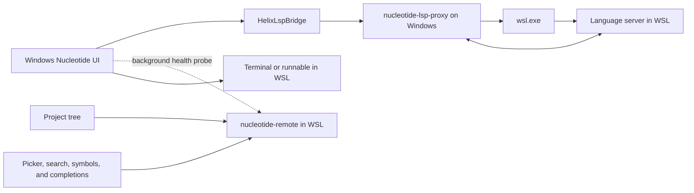

# WSL Remote Development

Nucleotide can open projects through Windows WSL UNC paths such as
`\\wsl.localhost\Ubuntu\home\iain\project`. For these workspaces the editor UI
continues to run on Windows, while project tools should run inside the WSL
distribution that owns the files.

## Product Model

The target experience follows the same broad shape used by VS Code Remote WSL,
Zed remote development, and JetBrains remote development:

- Keep rendering and input local so the editor feels native.
- Run language servers, terminals, project scanning, and workspace commands where
  the project files live.
- Install or discover a small remote helper by version, then reuse it from a
  remote cache instead of doing expensive setup on every window open.
- Translate paths at the client boundary so Windows UI code sees WSL UNC paths
  while remote tools see Linux paths.
- Treat remote support as project-local state, not a global mode that changes
  native Windows projects.

## Current Implementation

The initial WSL path supports WSL language servers without moving the full
editor backend into Linux:

- `nucleotide-env` detects WSL UNC roots and converts them to distro plus Linux
  path metadata.
- `ProjectEnvironment` captures project environment through `wsl.exe` for WSL
  roots and tags it with `NUCLEOTIDE_REMOTE_KIND=wsl`. These snapshots stay
  scoped to WSL launch paths instead of being applied to the Windows host
  process environment. WSL environment cache keys preserve the UNC path shape
  directly instead of canonicalizing through the Windows filesystem boundary.
- WSL workspaces force project LSP startup with fallback enabled, because
  project-level startup gives us one remote command boundary per language server.
- `nucleotide-lsp-proxy` maps file URIs between Windows WSL UNC URLs and Linux
  file URLs in both directions.
- `HelixLspBridge` launches WSL language servers through the proxy via `wsl.exe`
  and keeps the Windows editor side talking normal LSP. WSL LSP startup does
  not inject Linux environment snapshots into the Windows process; the remote
  launch boundary owns those values. The WSL proxy shim resolves the actual
  server command through the user's Linux shell when available, so language
  servers installed under user-managed paths are discovered inside the distro.
- `nucleotide-remote` is a versioned helper binary with `hello`, `env`,
  `metadata`, `root`, `list`, `create-file`, `create-directory`, `files`,
  `rename`, `delete`, `duplicate`, `move`, `search`, `read`, `read-full`,
  `write`, `set-readonly`, `format`, and `symbol-files`
  protocol commands.
  Metadata includes workspace marker and shallow source-directory facts so
  project/LSP detection can avoid repeated Windows UNC
  filesystem probes when the helper is available. Root detection walks parent
  directories inside WSL and returns Linux workspace/project roots for the
  Windows UI to map back to WSL UNC paths.
  Directory listing returns compact file metadata from inside WSL so the project
  tree can populate rows without enumerating `\\wsl...` paths through Windows.
  Absolute symlink targets in those listings are mapped back to same-distro WSL
  UNC paths for UI metadata, while relative symlink targets stay relative.
  Recursive file search returns picker-ready relative paths from inside WSL.
  Global text search walks ignore-filtered files and reads file contents inside
  WSL, returning relative path, line number, and line text matches to the
  Windows UI. Workspace symbol fallback scanning uses `symbol-files` to collect
  bounded, ignore-filtered file text inside WSL, then parses symbols on the
  Windows side with the existing Helix syntax loader.
  The `root`, `list`, `create-file`, `create-directory`, `rename`, `delete`,
  `duplicate`, `move`, `files`, `search`, `read`, `read-full`, `write`, and
  `set-readonly`, `format`, and `symbol-files` commands are part of helper
  protocol version 17, so older cached helpers are bypassed by the versioned
  cache path.
- Application startup schedules a short, non-blocking WSL helper health probe for
  WSL roots. Probes prefer
  `~/.cache/nucleotide/remote-helper/<protocol-version>/nucleotide-remote`
  before falling back to `nucleotide-remote` on `PATH`. Helper success is logged;
  helper failure can bootstrap from `NUCLEOTIDE_REMOTE_HELPER_INSTALL_SOURCE`
  when that variable points at a Linux helper binary, then falls back to direct
  WSL language server launch if the helper remains unavailable. Helper and
  environment commands use a portable `/bin/sh -c` wrapper that re-enters the
  user's login shell when available, so common user PATH setup is preserved
  without relying on non-portable `sh -l` behavior.
- Application startup and project LSP coordination use helper-backed root
  detection for WSL paths, avoiding parent-directory marker probes through the
  Windows UNC filesystem.
- Startup arguments, forwarded open requests, platform open events, file
  selections, file picker requests, and `gf`-style file navigation classify WSL
  paths without Windows `exists`/`is_dir`/`canonicalize` probes. When helper
  metadata is unavailable, path-shape fallbacks prefer opening extension-bearing
  paths and common extensionless project files such as `Makefile`, `Dockerfile`,
  and `README` as files, while other extensionless paths remain directories.
- Workspace terminals and runnable commands opened from WSL roots are launched
  through `wsl.exe --distribution <distro> --cd <linux-path>`, so shells and
  commands start where the project files live. Runnable/task environment
  variables are injected through Linux `env` after the `wsl.exe` boundary, so
  task-specific values are visible to the remote command instead of only the
  Windows launcher process. Rust-analyzer runnable payloads from WSL language
  servers normalize Linux `cwd`, `workspaceRoot`, and source locations back to
  same-distro WSL UNC paths before terminal dispatch, so extension-provided
  commands also route through the WSL terminal adapter. The local Rust fallback
  runnable discovery path also supports WSL files by probing Cargo roots through
  helper-backed directory listings instead of checking for `Cargo.toml` through
  the Windows UNC filesystem path.
- The file tree uses the remote helper for WSL initial root population,
  directory expansion, and directory refresh when a Tokio runtime is available.
  Native workspaces keep the existing local filesystem path. WSL file watching is
  disabled for the Windows watcher path so the UI does not pay for recursive UNC
  monitoring.
- Project tree New File, New Folder, Rename, Delete, Duplicate, and drag/drop
  moves use the helper-backed `create-file`, `create-directory`, `rename`,
  `delete`, `duplicate`, and `move` commands for WSL paths, then map Linux
  result paths back to WSL UNC before refreshing the parent and notifying
  language servers. LSP file-operation success checks trust WSL helper-backed
  operation results instead of revalidating paths through the Windows UNC
  filesystem.
- Local path completion uses the same helper-backed directory listing for WSL
  paths with a short timeout, avoiding per-keystroke `\\wsl...` directory reads
  from the Windows side.
- Command-prompt file and directory completions also use helper-backed WSL
  directory listing, preserving native prompt behavior without walking UNC paths
  from Windows.
- The file picker uses helper-backed recursive file search for WSL roots, so the
  expensive ignore-aware walk runs in Linux rather than across the Windows UNC
  filesystem boundary.
- File picker previews use the helper-backed `read` command for WSL file paths,
  so previewing a selected file reads a bounded text slice inside WSL instead of
  through the Windows UNC filesystem path.
- Text/code file opens use the helper-backed `read-full` command for WSL file
  paths, decoding bytes with Helix's normal file decoder and constructing a
  clean local document buffer without reading file contents through the Windows
  UNC filesystem path.
- Current-buffer `:write`/`:w` saves and save-as paths for WSL file paths use
  the helper-backed stdin-fed `write` command, so document contents are
  persisted inside the distro instead of through the Windows UNC filesystem
  path. Relative save-as paths resolve beside the current WSL document, Linux
  absolute paths map back to the same distro, and `:write!`/`:w!` skips the
  remote mtime guard and may create missing parent directories. LSP and
  configured external formatter auto-format-on-save are supported for WSL
  buffers; external formatter commands run through the Linux-side `format`
  helper command and receive buffer text over stdin. Formatter argument
  `%sh{...}` expansions for WSL buffers also run through the same distro shell
  path, rather than the Windows-side configured editor shell.
- `:write-all`/`:wa` saves modified WSL buffers through the same queued remote
  write path. Pure WSL write-all supports the same LSP auto-format path as
  current-buffer saves, including formatter argument expansion for non-focused
  buffers. Mixed local/WSL write-all formats local buffers through the normal
  local formatter path while still saving WSL buffers through the helper,
  avoiding a fallback through the Windows UNC filesystem for bulk saves.
- `:write-quit`/`:wq`/`:x` and `:write-buffer-close`/`:wbc` use the remote
  write path for WSL buffers before closing. These commands flush the queued
  save before closing, matching Helix's close-after-save sequencing.
- `:write-quit-all`/`:wqa`/`:xa` save WSL buffers through the remote write path,
  flush queued local and remote writes, and then close all views using Helix's
  quit-all ordering.
- WSL remote opens record the decoded BOM state and WSL remote saves feed that
  state back into Helix's encoder, so UTF BOMs are preserved even though Helix's
  document BOM flag is private.
- WSL remote saves preserve existing file symlinks by resolving the symlink in
  the Linux helper and atomically replacing the target file, rather than
  replacing the symlink path itself from Windows.
- The tab readonly toggle uses the helper-backed `set-readonly` command for WSL
  file tabs before updating Helix's document state, so lock/unlock reflects
  Linux file permissions instead of only local UI state.
- Git status and repository HEAD checks run through `wsl.exe` for WSL roots, so
  file decorations and VCS events use Linux Git against local Linux paths while
  still mapping results back to Windows WSL UNC paths for the UI. When file
  watcher events ask VCS to refresh diff hunks for WSL files, the current file
  contents are read through the helper-backed `read-full` command instead of
  through the Windows UNC filesystem path.
- Manifest-based project detection uses a WSL manifest delegate for WSL UNC
  paths. Marker checks and manifest reads run inside the distro through the
  shared WSL shell boundary with a per-detection existence cache, while native
  paths keep the normal filesystem delegate.
- Project type indicators use the helper-backed WSL directory listing when it is
  available, turning several synchronous marker-file checks into one Linux-side
  directory read.
- Global text search uses the helper-backed `search` command for WSL roots and
  merges those disk results with open editor buffers on the Windows side so
  unsaved edits remain authoritative.
- Workspace symbol fallback uses helper-backed `symbol-files` for WSL roots, so
  ignore walking and file reads stay in Linux while open buffers and syntax
  parsing stay local.

This means the first supported path is direct WSL LSP execution with path
translation. The helper is currently an optional foundation for richer remote
services rather than a hard dependency.

## Document I/O Boundary

Document opens now use helper-backed full-file reads for WSL paths, and the
common current-buffer write path now uses helper-backed remote writes. Saves
preserve Helix's pre-save whitespace/final-newline handling, encode the buffer
with Helix's current document encoding, enqueue the remote write on Helix's save
queue, persist through a Linux-side temp file, track remote modified times in
memory for external-modification protection, mark the document clean on success,
notify Helix's file-event handler, and emit LSP `didSave`.

The remaining document I/O work is to make this a first-class file-provider
boundary rather than a command interception. Broader symlink metadata parity
still needs dedicated plumbing.

## Runtime Flow

The proxy is deliberately the compatibility layer. It keeps existing editor and
Helix integration code mostly native while only translating the file URI shapes
that cross the process boundary.

## Remote Helper Direction

The next step toward a more native-feeling remote experience is to make
`nucleotide-remote` self-managing:

1. Resolve a per-distro helper path such as
   `~/.cache/nucleotide/remote-helper/<protocol-version>/nucleotide-remote`.
2. Probe that exact path before falling back to `PATH`. This is implemented for
   helper health, environment snapshot, and workspace metadata commands.
3. Bootstrap or update the helper when the cached binary is missing or reports a
   protocol mismatch. The first bootstrap path is explicit via
   `NUCLEOTIDE_REMOTE_HELPER_INSTALL_SOURCE`, because WSL must receive a Linux
   helper binary rather than the Windows GUI binary.
4. Move remote services behind helper commands where that improves latency or
   correctness, starting with environment, workspace metadata, root detection,
   directory listing, file search, global search, previews, and symbol file
   collection.
5. Keep direct WSL LSP launch as the fallback path so helper bootstrap problems
   do not block editing.

## References

- VS Code Remote WSL documentation:
  https://code.visualstudio.com/docs/remote/wsl
- Zed remote development documentation:
  https://zed.dev/docs/remote-development
- JetBrains remote development documentation:
  https://www.jetbrains.com/help/idea/remote-development-overview.html
